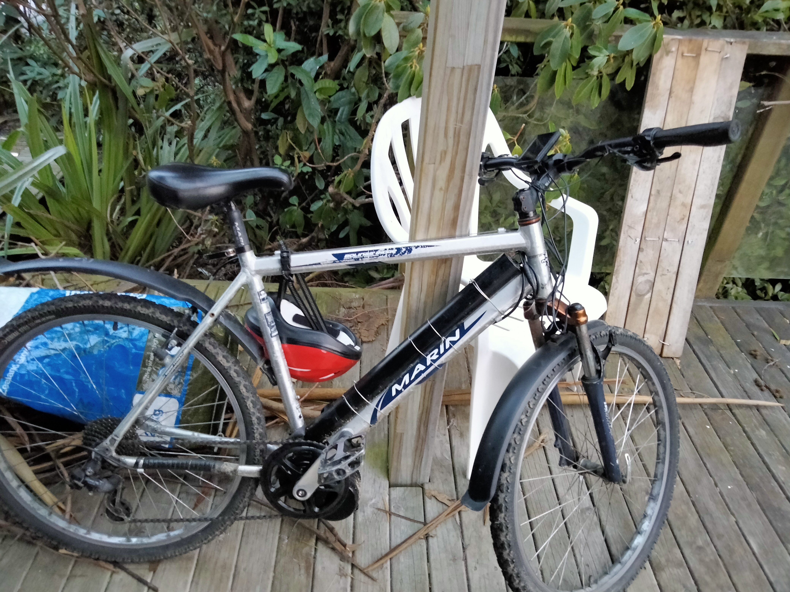

# First E-bike

One of my first electrical/mechanical projects: my dad wanted an e-bike in the family, so I suggested I build it and he paid for it. This was a simple assembly job — taking the front gears off an old bike along with the crankshaft, and replacing them with the mid-drive motor and crankshafts from the kit.

The kit was super expensive — close to $1000. The battery, on the other hand, was a cheap $50 e-scooter battery.

Not much else interesting about the build: wired up the BMS, motor and screen, and it worked.

## Specs

- 36V, 500W (peaked at 750W)
- Mid-drive motor

## Photos

