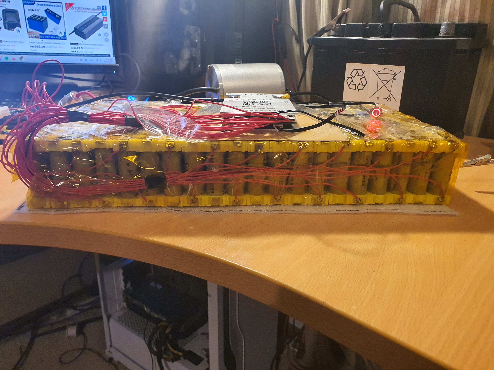
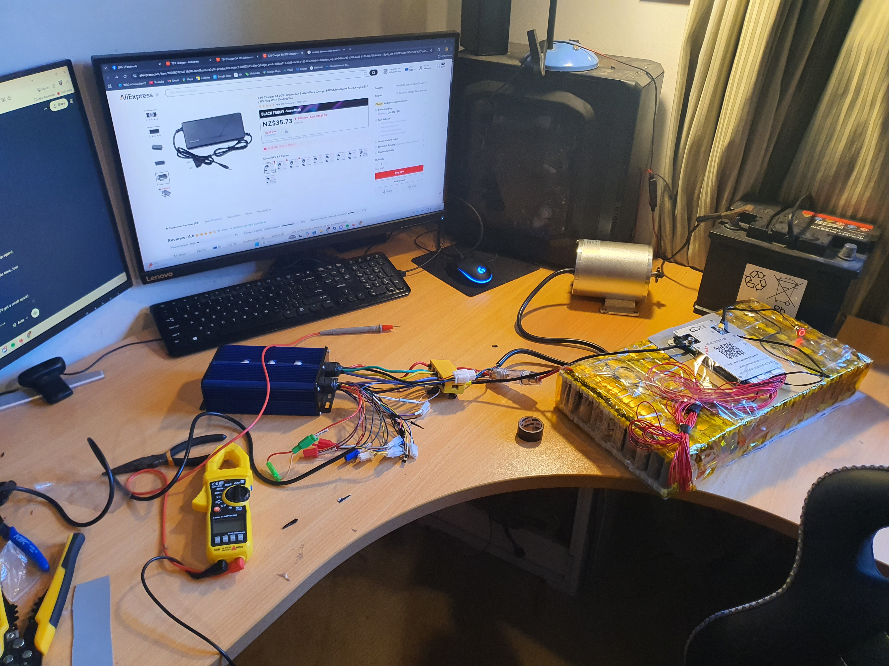
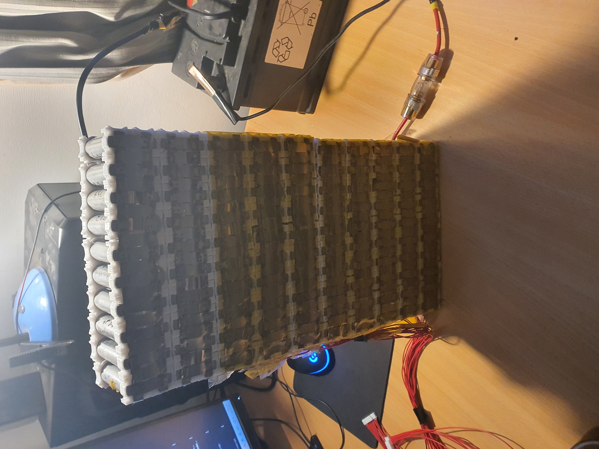
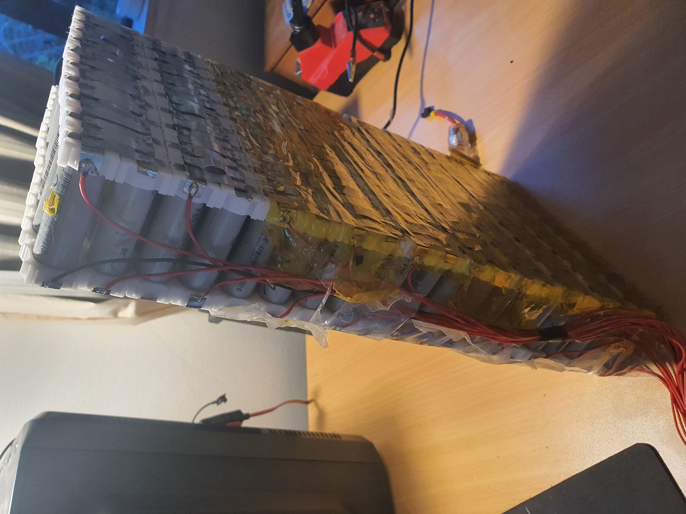
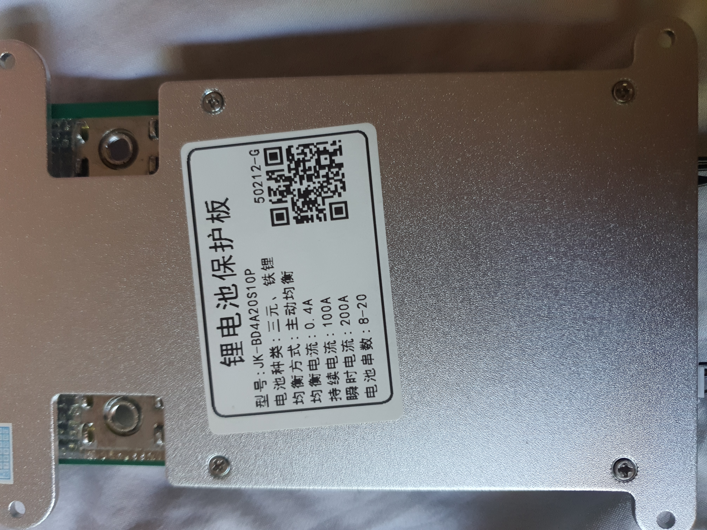
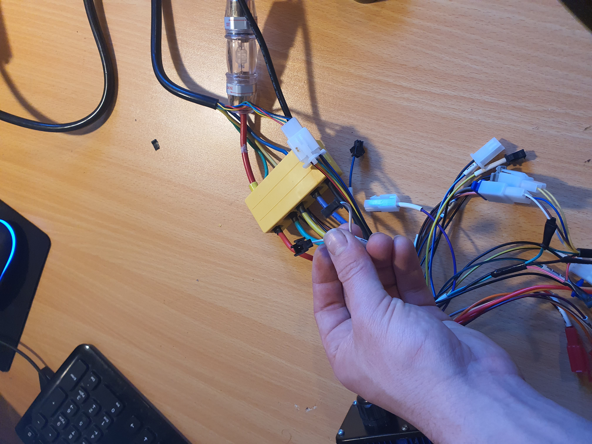
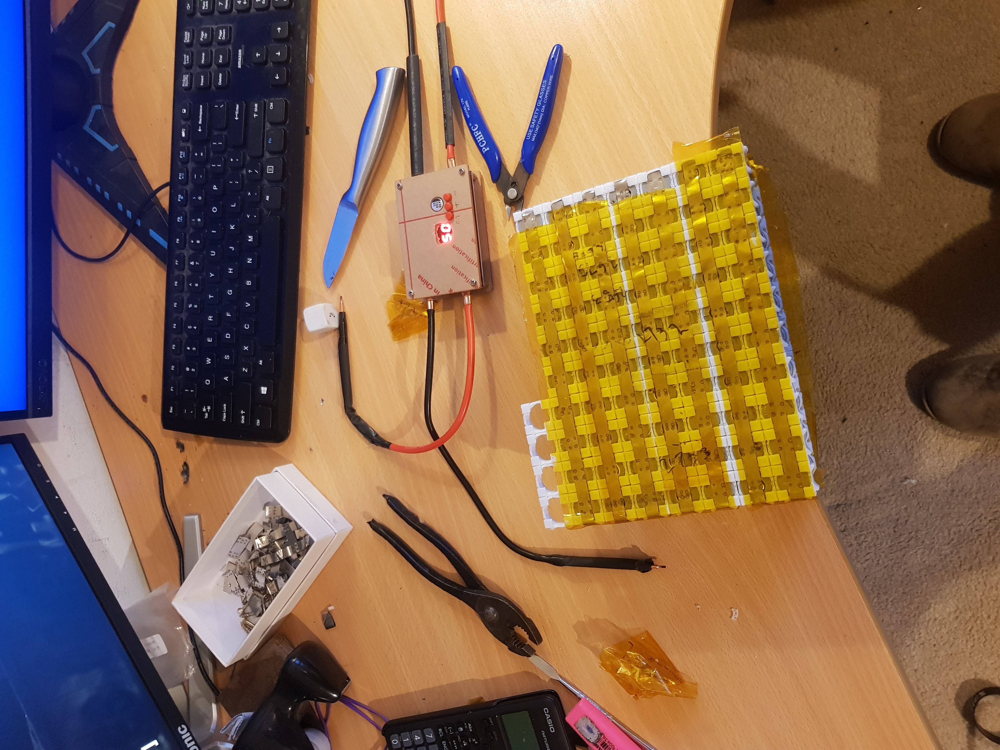

# 72V 3kW Go-Kart Battery Pack

A 72V lithium-ion battery pack (20S10P) built from recycled 18650 cells to power a 3kW electric go-kart. Built for roughly **TODO** NZD, compared with $600 to $1000+ for a bought pack that could do the same job. (All prices are in NZD.)

The go-kart needs 72V and 3kW, which means a lot of current. Packs that could supply that and last as long as I wanted cost at least $600, and usually around $1000.

## Sourcing the cells

On Marketplace I found 36V 600Wh e-bike batteries for about $50 each. That's half the voltage I needed. My first attempt was wiring two in series to get 72V. It worked for a while, but the capacity was lower than I wanted, it was unreliable, and it was less safe.

The better idea was to take the packs apart and reuse the cells in a new 72V arrangement. I bought 3 packs for this (TODO: total number of packs and cells used).

## The build

### Version 1: taped together
My first pack was held together with tape. the cells rubbed against each other, there was no spacing between them, no cooling, so it would be a very risky batterypack design.

### Version 2: 3D-printed holders
I redesigned it with 3D-printed 18650 holders that leave air gaps between the cells. This does three things:
- If one cell fails, it's isolated from the ones next to it.
- The pack stays much cooler.
- The cells no longer rub against each other.

### Spot welding the connections
Spot welding joins the cells to the nickel strips without heating them the way soldering would. I didn't want to spend about $100 on a welder for a battery that cost around $250 in total (TODO: check this wording is right).

**Homemade welder:** I built one from a car battery and MOSFETs (electronic switches) taken from a broken e-bike controller. It worked, but only barely. The MOSFETs couldn't handle short bursts of very high current, and each one blew out after about three welds. I went through all 4. Full details are in a [separate write-up](../homemade-spot-welder/README.md).

**Bought welder:** Since the idea worked in principle, I looked for a properly built version and found one from China for about $25. It worked perfectly.

**Nickel strip:** I used 0.3 x 15 mm strip for the series connections and 0.10 x 15 mm for the parallel ones, sized from current calculations (TODO: add the calculations if you can recreate them).

**Power source:** Welding half the pack was wearing out my car battery, so I bought a larger truck battery from Marketplace to finish the job without affecting the car.

**A close call:** While spot welding, I accidentally dropped a strip of nickel across two groups. It shorted out and went white hot almost instantly. Without thinking, I grabbed it with my bare hands and threw it across the room. It had partially welded itself on, but thankfully it was hot enough that it didn't actually hold and came off. After that I checked the cell voltages — everything seemed fine and healthy — so I continued spot welding. However, I had learned my lesson: I taped over everything I wasn't spot welding to make sure I didn't make the same mistake again. I burned my fingers pretty badly grabbing at that piece.

### Wiring the BMS
The BMS (battery management system) is the pack's safety controller. It watches the voltage of each group of cells and protects the pack. I bought a Bluetooth BMS from AliExpress for about $40. I paid roughly $10 extra for Bluetooth and it was worth it, since as a beginner I needed it for diagnostics.

To connect it, I soldered a wire to each side of the pack. I kept the iron on for as short a time as possible so the heat wouldn't damage the cells, and put the larger blobs of solder between the cells rather than on top of them. It took a while to work out the wiring, but it worked first time once connected.

Through Bluetooth I can see the power draw and the voltage of each parallel group, shut the power off remotely, and set a maximum and minimum charge level.
## Powering it up for the first time

## Photos

